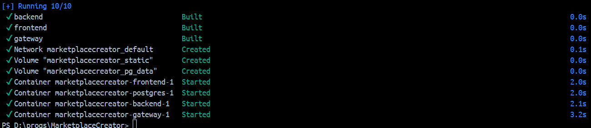

# MarketplaceCreator
# ИНСТРУКЦИЯ как запустить наш проект

1. Скачай docker engine в любом виде ( м.б. docker desktop )
2. Склонируй этот репозиторий ( https://github.com/maks-march/MarketplaceCreator.git )
3. Найди docker-compose.yaml
4. В консоли передите в директурию docker-compose.yaml, например PS D:\progs\MarketplaceCreator> ( можно в консоли docker desktop)
5. Выполните docker compose up -d
6. Ждите когда скачаются images (nginx, postgres, asp.net)

7. Готово!

# Что дальше?
Можно перейти по http://localhost:80 и откроется главная страница фронтенда, 
можно перейти на https://localhost/swagger чтобы увидеть API